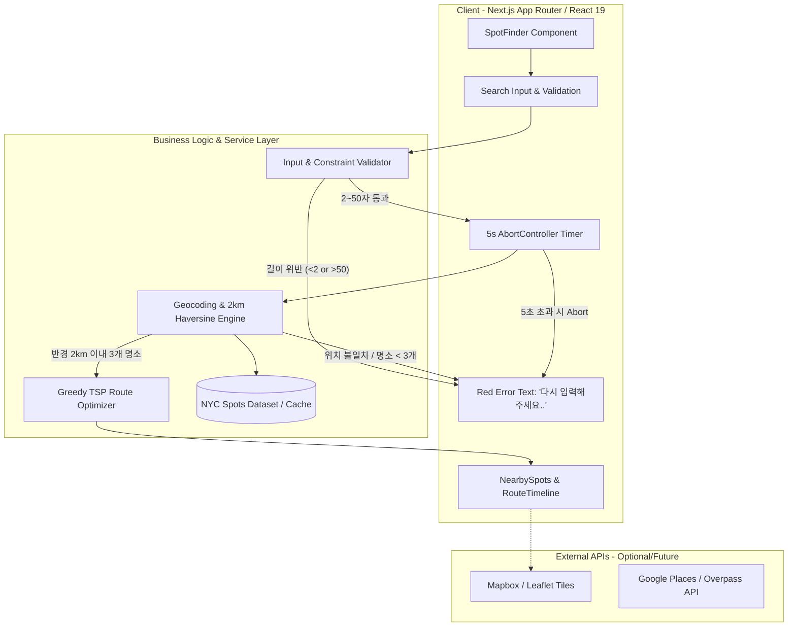
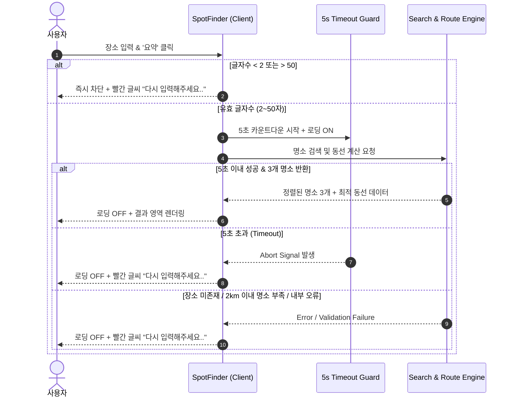

# 🏛️ NYC 2km Spot & Route Finder - 시스템 아키텍처 (System Architecture)

본 문서는 NYC 2km Spot & Route Finder의 구조, 데이터 흐름, 컴포넌트 계층 및 예외 처리 아키텍처를 정의합니다.

---

## 1. 시스템 개요 다이어그램 (Architecture Diagram)



---

## 2. 데이터 흐름 (Data Flow)

### 2.1 정상 흐름 (Happy Path)
1. **사용자 입력**: 사용자가 검색창에 장소명(2~50자) 입력 후 "요약" 버튼 클릭 (또는 Enter).
2. **사전 검증**: `Validator`가 글자수(`2 <= length <= 50`) 확인.
3. **로딩 및 타이머 시작**: 버튼이 "검색 중" 스피너로 전환되며, 5초 타임아웃 `AbortController` 가동.
4. **위치 식별 및 2km 필터링**: 입력된 기준 위치 좌표를 찾고, 반경 2.0km 이내의 명소를 거리순으로 정렬하여 상위 3곳 선정.
5. **동선 최적화**: 기준 위치 → 명소 1 → 명소 2 → 명소 3 순서의 구간별 거리/시간 및 총 이동 메트릭 산출.
6. **렌더링**: 로딩 해제 후 명소 3개 카드 및 추천 이동 동선 타임라인 표출.

### 2.2 예외 및 에러 처리 흐름 (Fail-Safe Error Flow)


---

## 3. 핵심 모듈 설계 (Core Modules)

### 3.1 5초 타임아웃 컨트롤러 (`lib/timeout.ts`)
```typescript
export async function withTimeout<T>(
  promiseFactory: (signal: AbortSignal) => Promise<T>,
  timeoutMs: number = 5000
): Promise<T> {
  const controller = new AbortController();
  const timeoutId = setTimeout(() => {
    controller.abort(new Error('TIMEOUT'));
  }, timeoutMs);

  try {
    const result = await promiseFactory(controller.signal);
    clearTimeout(timeoutId);
    return result;
  } catch (err) {
    clearTimeout(timeoutId);
    throw err;
  }
}
```

### 3.2 하버사인 2km 반경 계산 (`lib/geo.ts`)
```typescript
const EARTH_RADIUS_KM = 6371;

export function calculateDistanceKm(lat1: number, lon1: number, lat2: number, lon2: number): number {
  const dLat = ((lat2 - lat1) * Math.PI) / 180;
  const dLon = ((lon2 - lon1) * Math.PI) / 180;
  const a =
    Math.sin(dLat / 2) * Math.sin(dLat / 2) +
    Math.cos((lat1 * Math.PI) / 180) *
      Math.cos((lat2 * Math.PI) / 180) *
      Math.sin(dLon / 2) *
      Math.sin(dLon / 2);
  const c = 2 * Math.atan2(Math.sqrt(a), Math.sqrt(1 - a));
  return Number((EARTH_RADIUS_KM * c).toFixed(2));
}
```

### 3.3 최적 동선 계산기 (`lib/route-optimizer.ts`)
- **알고리즘**: 기준점(출발지)에서 가장 가까운 명소부터 순차적으로 방문하는 탐욕적 최근접 이웃(Greedy Nearest Neighbor) 알고리즘 적용.
- **도보 시간 산정**: 뉴욕 도심 평균 도보 속도(약 4.5km/h ~ 4.8km/h, 1km당 약 13분) 기준 산출.

---

## 4. 디렉토리 구조 (Directory Structure)

```
nyc-2km-spot-and-route-finder/
├── app/
│   ├── api/
│   │   └── spots/
│   │       └── search/
│   │           └── route.ts         # 검색 API 라우트
│   ├── globals.css                  # 전역 스타일 및 디자인 토큰
│   ├── layout.tsx                   # 메인 레이아웃 (SEO 메타데이터)
│   └── page.tsx                     # 메인 페이지 진입점
├── components/
│   ├── nearby-spots.tsx             # 명소 3곳 카드 그리드 컴포넌트
│   ├── route-timeline.tsx           # 최적 동선 타임라인 컴포넌트
│   ├── site-header.tsx              # 상단 헤더 컴포넌트
│   ├── spot-finder.tsx              # 검색 폼 & 상태 제어 컨테이너
│   └── ui/                          # 공통 UI 컴포넌트 (Button, Input 등)
├── docs/
│   ├── API_AND_DATA_SPEC.md         # 데이터 모델 및 API 명세서
│   ├── ARCHITECTURE.md              # 시스템 아키텍처 정의서 (본 문서)
│   ├── DEVELOPMENT_PLAN.md          # 마스터 개발 계획서
│   └── SPRINT_BACKLOG.md            # 스프린트 백로그 및 진척도 관리
├── lib/
│   ├── geo.ts                       # 거리 계산 및 지리 유틸
│   ├── nyc-dataset.ts               # NYC 주요 명소 데이터셋
│   ├── route-optimizer.ts           # 동선 최적화 알고리즘
│   ├── spots.ts                     # 데이터 타입 및 인터페이스
│   ├── timeout.ts                   # 5초 타임아웃 유틸
│   └── validator.ts                 # 입력값 및 응답 유효성 검증
├── PRD.md                           # 제품 요구사항 정의서 (PRD)
├── package.json
└── tsconfig.json
```
