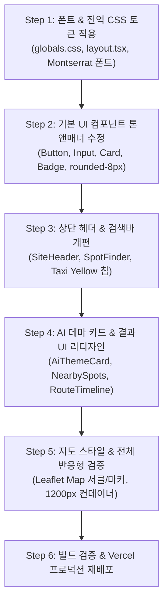

# 🎨 NY Route (Urban Velocity) 디자인 시스템 개편 계획서

## 1. 개요 및 목적
- **디자인 시스템 명**: **Urban Velocity (도시적 속도감)**
- **브랜드 정체성**: Urban & Professional, Efficient & Fast, Reliable & Trustworthy, Dynamic & Energetic
- **목적**: 루트에 정의된 `design.md` 명세에 맞추어 전체 웹 애플리케이션의 컬러 팔레트, 폰트(Montserrat), 라운드 반경(8px), 섀도우, 카드 및 버튼 컴포넌트의 톤앤매너를 뉴욕 특유의 세련되고 역동적인 비주얼로 전면 개편.

---

## 2. 디자인 토큰 및 가이드라인 정의 (`design.md` 기준)

### 2.1 컬러 시스템 (Color Palette)
| 역할 | 토큰명 | HEX 코드 | 설명 |
|---|---|---|---|
| **Primary** | `primary` | `#305cd4` | New York Blue (신뢰감 있고 딥한 블루) |
| **Secondary / Highlight** | `secondary` | `#ffcc00` | Taxi Yellow (뉴욕 옐로우 캡 포인트) |
| **Surface (배경)** | `surface` | `#fbf8ff` | 쿨톤의 밝고 깨끗한 서피스 배경 |
| **On-Surface (텍스트)** | `on-surface` | `#1a1b21` | 깊이감 있는 딥 다크 텍스트 |
| **Surface Container Low** | `surface-container-low` | `#f4f2fe` | 연한 퍼플/블루 틴트의 연보라/그레이 톤 |
| **Surface Container High** | `surface-container-high` | `#eceaf4` | 카드 테두리 및 구분선용 |
| **Error** | `error` | `#ba1a1a` | PRD 표준 에러 ("다시 입력해주세요..") |

### 2.2 타이포그래피 (Typography)
- **Primary Font**: `Montserrat, sans-serif` (Google Fonts 연동)
- **한글 보조 Font**: `Pretendard / IBM Plex Sans KR`
- **Headings**:
  - H1: `font-bold text-3xl md:text-4xl leading-tight tracking-tight`
  - H2: `font-bold text-2xl leading-snug`
  - H3: `font-semibold text-xl`
- **Body**:
  - Large: `text-lg leading-relaxed`
  - Medium: `text-base leading-normal`
  - Small: `text-sm font-medium`

### 2.3 레이아웃 및 쉐이프 (Layout & Shapes)
- **Border Radius**: `8px` (`ROUND_EIGHT`, `rounded-lg`)로 통일 (기존 16~24px 과도한 둥근 모서리 정리)
- **Shadows**:
  - `sm`: `0 1px 2px 0 rgb(0 0 0 / 0.05)`
  - `md`: `0 4px 6px -1px rgb(0 0 0 / 0.1)`
- **Container Max Width**: 최대 `1200px` (시원하고 모던한 그리드)

---

## 3. 단계별 수정 및 개편 작업 계획

### [Step 1] 전역 스타일 & 디자인 토큰 업데이트
- **대상 파일**: `app/globals.css`, `app/layout.tsx`
- `Montserrat` 구글 폰트 추가 및 `@theme` 변수 매핑
- `#305cd4` (Primary), `#ffcc00` (Secondary/Accent), `#fbf8ff` (Surface) 등 CSS 변수 재정의
- `--radius: 0.5rem` (8px) 설정

### [Step 2] 공통 UI 컴포넌트 스타일 정돈
- **대상 파일**: `components/ui/button.tsx`, `components/ui/card.tsx`, `components/ui/badge.tsx`, `components/ui/input.tsx`
- 8px 라운드(`rounded-lg`), `shadow-md`, `border-[#eceaf4]` 등 디자인 가이드에 일치

### [Step 3] SiteHeader 및 검색 영역 리디자인
- **대상 파일**: `components/site-header.tsx`, `components/spot-finder.tsx`
- New York Blue & Taxi Yellow 포인트가 들어간 아이콘 및 뱃지
- 상단 앱바 `backdrop-blur` 적용
- "요약" CTA 버튼: `bg-[#305cd4] text-white hover:opacity-90 rounded-lg shadow-sm`
- 퀵 칩(Quick Chips): 세련된 Urban 스타일 태그

### [Step 4] 결과 영역 및 AI 컴포넌트 리디자인
- **대상 파일**: `components/ai-theme-card.tsx`, `components/nearby-spots.tsx`, `components/route-timeline.tsx`, `components/share-button.tsx`
- **AiThemeCard**: New York Blue & Taxi Yellow 그라데이션, 전문적인 도슨트 브리핑 레이아웃
- **NearbySpots**: `bg-white`, `border-[#eceaf4]`, `shadow-md`, `rounded-lg` 카드 그리드
- **RouteTimeline**: 뉴욕 지하철 노선도를 연상시키는 New York Blue 연결선과 타임라인
- **ShareButton**: 일관된 `rounded-lg` 모던 버튼

### [Step 5] Leaflet 지도 스타일 및 레이아웃 최적화
- **대상 파일**: `components/map/spot-map.tsx`, `app/page.tsx`
- 반경 2km 원(Circle) 색상을 `#305cd4` (New York Blue)로 적용
- 컨테이너 너비를 `max-w-5xl` (~1100px)로 확장하여 데스크톱 가독성 극대화

### [Step 6] 빌드 검증 및 Vercel 재배포
- `npm test` 단위 테스트 20개 검증
- `next build` 빌드 에러 및 번들 최적화 확인
- Vercel CLI (`vercel --prod --yes`) 프로덕션 자동 배포

---

## 4. 검증 기준 (DoD - Definition of Done)
1. `design.md`에 명시된 7개 컬러 코드와 Montserrat 폰트가 정확히 적용될 것.
2. 모든 카드의 모서리 반경이 `8px` (`rounded-lg`)로 통일될 것.
3. PRD의 2~50자 유효성, 5초 타임아웃, 빨간색 에러(`다시 입력해주세요..`)가 100% 보존될 것.
4. Next.js 빌드 성공 및 Vercel 배포 URL에서 모든 UI가 깨짐 없이 렌더링될 것.
