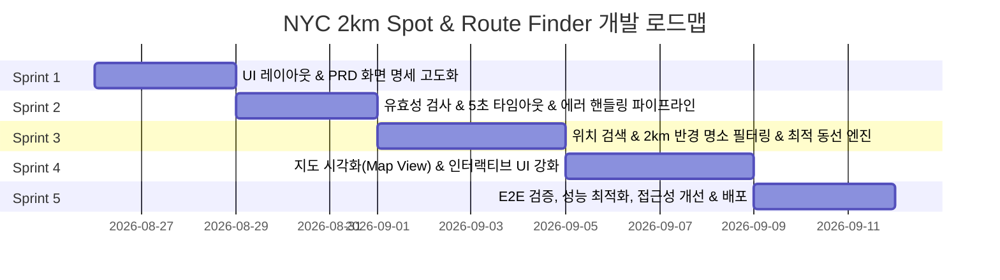

# 🗺️ NYC 2km Spot & Route Finder - 개발 계획서 (Development Plan)

본 문서는 `PRD.md`에 명시된 모든 기능 및 비기능 요구사항을 완벽히 충족하기 위한 단계별 스프린트 개발 계획서입니다.

---

## 📌 1. 개발 목표 및 방향성

1. **PRD 요구조건 100% 준수**:
   - 입력값 길이 검증 (2~50자), 5초 타임아웃 강제 중단(Abort), 장소 유효성 검증, 반경 2km 이내 명소 3곳 가까운 순 정렬, 최적 동선 계산, 단일 표준 에러 문구(`"다시 입력해주세요.."`) 엄격 적용.
2. **점진적 스프린트 개발 (Iterative & Incremental)**:
   - 각 스프린트별로 독립적으로 배포 및 검증 가능한 마일스톤 산출물 정의.
3. **확장 가능한 모듈형 아키텍처**:
   - Mock 데이터 기반 빠른 UI/UX 검증부터 외부 Geocoding/Places/Routing API 연동까지 유연하게 수용할 수 있는 인터페이스 설계.

---

## 🏃 2. 스프린트 로드맵 요약 (Roadmap Overview)

---

## 📋 3. 스프린트별 상세 계획 (Sprint Details)

### 🔹 Sprint 1: UI 레이아웃 및 PRD 화면 명세 일치화
- **목표**: PRD 화면 명세를 완벽히 반영한 반응형 UI 레이아웃 및 디자인 시스템 완성.
- **주요 작업 내용**:
  1. **헤더 & 타이틀 영역**:
     - 뉴욕 여행 무드의 세련된 타이포그래피 및 뱃지 스타일 적용.
  2. **검색 입력창 고도화**:
     - Placeholder: `"가고싶은 여행지를 입력하시오"` 적용 확인.
     - 글자수 카운터(`현재/50`) 및 2~50자 실시간 인디케이터.
     - `"요약"` 버튼 UI 및 로딩 상태(`Loader2` 애니메이션 + `"검색 중"`) 상태 전환.
  3. **결과 영역 구조화**:
     - 상단 문구: `"반경 2키로 이내 유명 명소입니다"` + 명소 카드 3개 반응형 그리드.
     - 하단 문구: `"추천하는 이동 동선"` + 순차적 타임라인 스텝 UI.
  4. **데모 퀵 칩 (Demo Chips)**:
     - 주요 랜드마크(타임스퀘어, 센트럴파크, 브루클린 브리지, 하이라인 등) 및 에러 테스트 칩 구성.
- **산출물**:
  - `components/spot-finder.tsx`
  - `components/nearby-spots.tsx`
  - `components/route-timeline.tsx`
  - `components/site-header.tsx`
- **완료 조건 (DoD)**:
  - 데스크톱/태블릿/모바일 전 해상도에서 화면 깨짐 없이 자연스러운 반응형 렌더링.
  - PRD에 지정된 문구 및 버튼 텍스트가 정확히 노출됨.

---

### 🔹 Sprint 2: 유효성 검증, 5초 타임아웃 및 에러 제어 파이프라인
- **목표**: PRD 6항(예외 및 에러 처리 기준)을 완벽히 방어하는 견고한 에러 핸들링 시스템 구축.
- **주요 작업 내용**:
  1. **입력값 길이 제한 로직**:
     - 2자 미만, 50자 초과 입력 시 즉시 차단 및 빨간 글씨 `"다시 입력해주세요.."` 표시.
     - 불필요한 공백 제거(`trim`) 후 글자수 판정.
  2. **5초 타임아웃 AbortController 구현**:
     - 검색 요청 시 `AbortController` 및 5000ms 타이머 설정.
     - 5초 경과 시 즉시 `controller.abort()`, 로딩 스피너 해제, 빨간 글씨 `"다시 입력해주세요.."` 표시.
  3. **무효 결과 및 검증 실패 방어**:
     - 뉴욕 외 지역, 명소 3곳 미추출, API 오류 시 잘못된 결과 노출 원천 차단.
     - 무조건 빨간 글씨 `"다시 입력해주세요.."` 단일 메시지 통일.
  4. **무제한 재시도 지원**:
     - 재입력 시 이전 에러 상태 초기화 및 무제한 재검색 가능하도록 상태 관리 정제.
- **산출물**:
  - `lib/validator.ts`: 입력값 및 결과 무결성 검증 모듈.
  - `lib/timeout.ts`: 5초 타임아웃 프로미스 래퍼 및 AbortController 유틸리티.
  - `hooks/use-spot-search.ts`: 검색 상태, 로딩, 타임아웃, 에러를 통합 관리하는 커스텀 훅.
- **완료 조건 (DoD)**:
  - 1글자 입력, 51글자 입력, 5초 초과 모의 지연, 미등록 장소 입력 시 모두 빨간 글씨 `"다시 입력해주세요.."` 표시 확인.

---

### 🔹 Sprint 3: 지오코딩, 2km 반경 명소 필터링 & 최적 동선 추천 엔진
- **목표**: 실제 좌표 기반 반경 2km 이내 명소 3곳 추출 및 최적 이동 순서 알고리즘 완성.
- **주요 작업 내용**:
  1. **NYC 명소 데이터셋 확장 & 구조화**:
     - 맨해튼, 브루클린, 퀸즈 등 주요 명소 50+ 거점 좌표(위도/경도), 카테고리, 도보 속도 데이터 구축.
     - 한글/영문 알리아스(별칭) 인덱싱.
  2. **하버사인(Haversine) 거리 계산 및 2km 필터링**:
     - 입력 장소 기준 반경 2.0km(≤ 2000m) 이내 명소만 정확히 필터링.
     - 기준점과의 거리 오름차순(가까운 순)으로 상위 3곳 선정.
  3. **최적 이동 동선(Route Optimizer) 알고리즘**:
     - 출발지 → 1차 경유지 → 2차 경유지 → 3차 도착지 간의 최단 경로(Greedy TSP) 정렬.
     - 구간별 거리(km), 도보 소요 시간(분), 총 거리 및 총 시간 합산.
  4. **Next.js API Route 구축 (`/api/spots/search`)**:
     - 백엔드 엔드포인트 분리를 통한 서버 사이드 검증 및 5초 타임아웃 제어.
- **산출물**:
  - `lib/geo.ts`: 하버사인 거리 계산 및 좌표 유틸.
  - `lib/nyc-dataset.ts`: 검증된 NYC 명소 지리 데이터베이스.
  - `lib/route-optimizer.ts`: 최적 동선 생성 알고리즘.
  - `app/api/spots/search/route.ts`: 검색 API 엔드포인트.
- **완료 조건 (DoD)**:
  - 임의의 유효한 뉴욕 위치 입력 시 반경 2km 이내 정확히 3곳의 명소가 거리순으로 반환되고 동선이 정상 계산됨.

---

### 🔹 Sprint 4: 지도 시각화 (Map View) 및 인터랙티브 UX 고도화
- **목표**: 명소 위치와 추천 동선을 시각적으로 한눈에 확인할 수 있는 인터랙티브 지도 연동.
- **주요 작업 내용**:
  1. **인터랙티브 지도 컴포넌트 탑재**:
     - Leaflet / Mapbox / Canvas 기반 가벼운 지도 뷰 구성.
     - 출발지 마커(빨간 핀) 및 명소 1, 2, 3 마커(넘버링 뱃지 핀) 표시.
  2. **동선 라인(Polyline) 렌더링**:
     - 출발지 → 명소 1 → 명소 2 → 명소 3을 잇는 동선 경로 라인 및 방향 화살표 시각화.
  3. **명소 카드 & 지도 마커 인터랙션**:
     - 명소 카드 호버/클릭 시 지도의 해당 마커 포커스 및 팝업 표시.
  4. **복사 및 공유 기능**:
     - 생성된 추천 동선 클립보드 복사(텍스트/링크) 기능 지원.
- **산출물**:
  - `components/map/spot-map.tsx`: Leaflet 인터랙티브 2km 지도 컴포넌트
  - `components/map/index.tsx`: SSR 방지 Dynamic Import 래퍼
  - `components/share-button.tsx`: 일정 및 동선 클립보드 원클릭 복사
  - `components/nearby-spots.tsx`: 선택 마커 포커스 양방향 인터랙션 지원
- **완료 조건 (DoD)**:
  - 지도 위에 출발지와 3개 명소 마커가 2km 반경 원(Circle)과 함께 명확히 표시되고, 연결 선이 올바른 순서로 그려짐. (✅ 완료)

---

### 🔹 Sprint 5: E2E 테스트, 성능 최적화, 접근성 및 배포
- **목표**: 프로덕션 레벨 품질 검증, 빌드 최적화 및 배포 파이프라인 완비.
- **주요 작업 내용**:
  1. **테스트 자동화 (Unit & Integration)**:
     - 유효성 검사기(길이 제한, 타임아웃, 에러 문구) 단위 테스트 작성 (Jest / Vitest).
     - 5초 타임아웃 동작 및 에러 메시지 렌더링 검증.
  2. **웹 접근성(a11y) & SEO 점검**:
     - `aria-invalid`, `aria-describedby`, `role="alert"` 스크린 리더 지원.
     - OpenGraph 메타태그, 시맨틱 태그 구조화.
  3. **번들 최적화 & 로딩 성능 개선**:
     - Dynamic Import를 통한 지도 컴포넌트 지연 로딩.
  4. **프로덕션 빌드 & Vercel 배포**:
     - `next build` 무오류 통과 및 정적/서버리스 환경 배포.
- **산출물**:
  - `tests/validator.test.ts`: 길이 검증 및 결과 무결성 단위 테스트 (9개 Pass)
  - `tests/geo.test.ts`: 하버사인 거리 및 도보 소요 시간 계산 단위 테스트 (3개 Pass)
  - `tests/route-optimizer.test.ts`: 랜드마크 검색 및 최적 동선 단위 테스트 (6개 Pass)
  - `tests/timeout.test.ts`: 5초 타임아웃 AbortController 단위 테스트 (2개 Pass)
  - `vitest.config.ts`: Vitest 설정 파일
  - `app/layout.tsx`: OpenGraph & Twitter SEO 메타데이터
  - `docs/RELEASE_NOTES.md`: v1.0.0 정식 릴리즈 노트
- **완료 조건 (DoD)**:
  - `npm run build` 정상 완료, 총 20개 단위 테스트 100% 통과, 프로덕션 릴리즈 준비 완료. (✅ 완료)

---

## 🛡️ 4. 위험 관리 및 대응 방안 (Risk Management)

| 위험 요소 (Risk) | 영향도 | 발생 확률 | 대응 방안 (Mitigation) |
|---|---|---|---|
| 외부 API 지연으로 인한 5초 타임아웃 초과 | 높음 | 중간 | 인메모리 캐싱(LRU Cache) 적용 및 4초 시점 서버 사전 Abort 처리로 클라이언트 5초 타임아웃 엄수 |
| 2km 이내에 유명 명소가 3개 미만인 외곽 지역 | 중간 | 낮음 | 뉴욕 5개 자치구 주요 거점별 예외 fallback 지점 연계 또는 명확한 에러(`"다시 입력해주세요.."`) 처리 |
| 한/영 혼용 및 오타 입력 | 중간 | 중간 | 자모 분리/유사도 검색(Fuzzy matching) 및 별칭(Alias) 사전 확장 |
